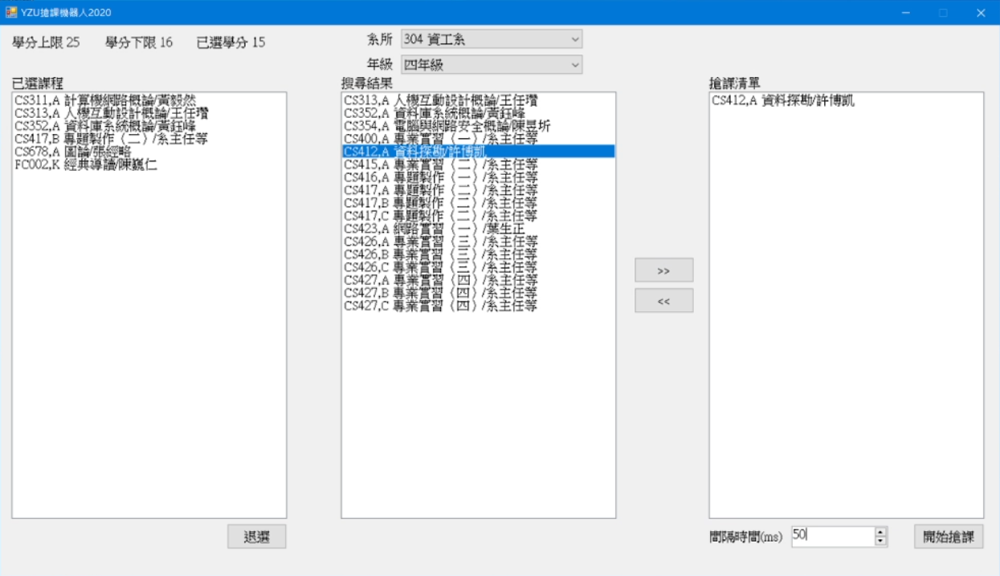

 

  

  <h3 align="center">YZU Course Bot</h3>

  

    一個元智大學搶課機器人的 "POC"
  

## 關於專案

最近在整理以前大學寫的一些東西，這是一個元智搶課機器人的 "**概念驗證**"，沒有辦法直接拿來使用，因為 "**缺少一些無法獲取的敏感參數**"，主要是用來呈現概念上如何實現搶課可能的辦法。

這支程式主要的概念是模擬學校的APP，並使用APP內選課的功能不斷重複加選來實現搶課。

程式內主要展示的功能概念有，
 - 模擬手機APP登入
 - 查詢系所年級課程資訊
 - 查詢個人學分上/下限，以及已選學分
 - 查詢已選課程
 - 退選已選課程
 - 不斷重複加選來實現搶課

 

警告: 因為是我大三初弄的東西，後來也沒有加以整理，所以Code非常的雜亂🤣。

## Demo

以上示範片段是使用Mock Server架設測試用API後，錄製的一個想像概念實現後程式會如何運作的示例。

## 致謝

* [Bot icons created by Smashicons - Flaticon](https://www.flaticon.com/free-icons/bot)